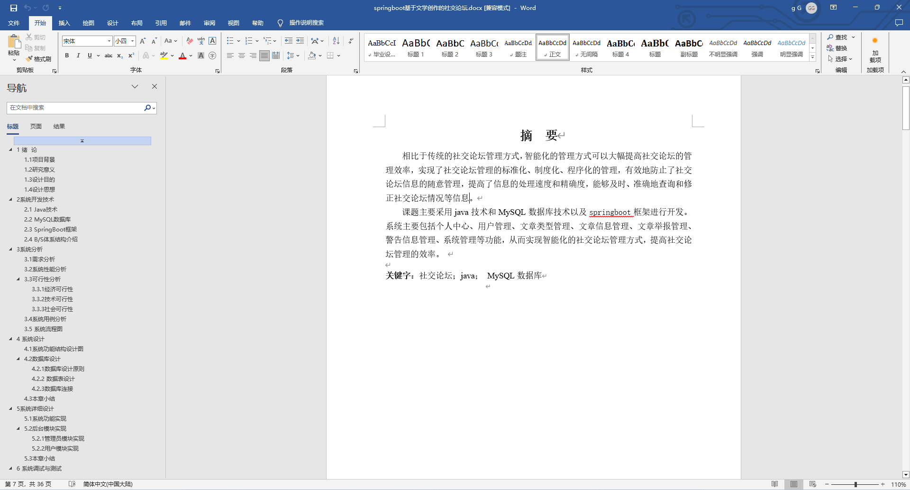
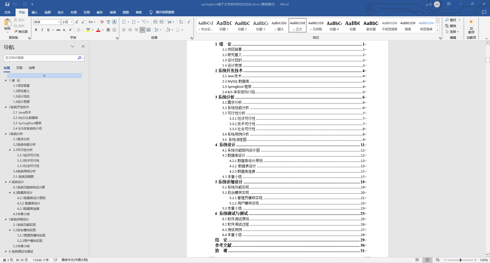
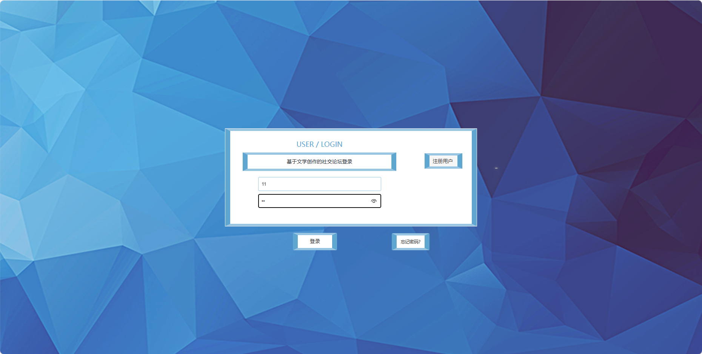
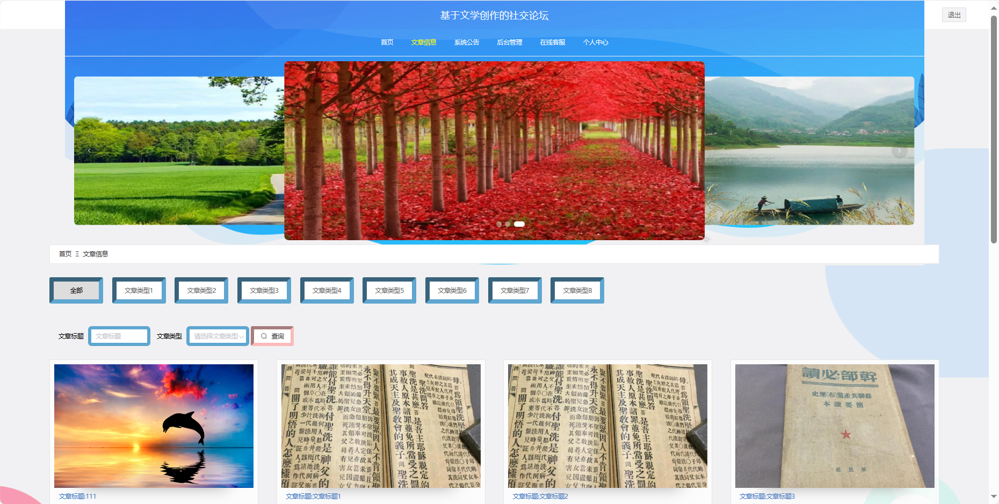
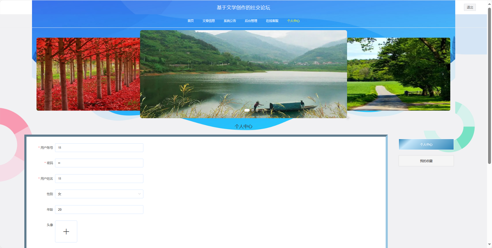
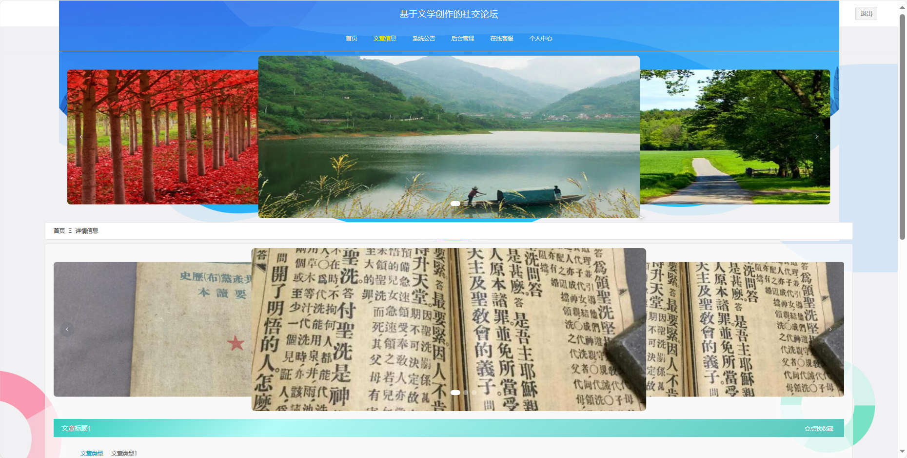
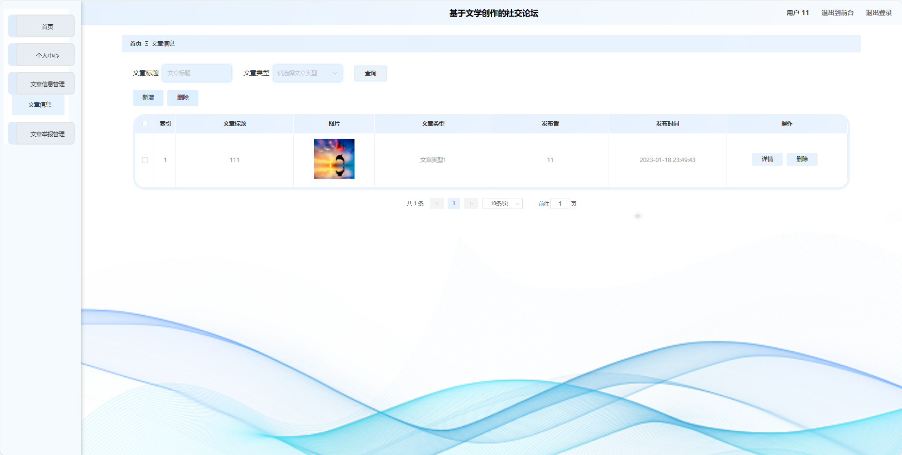

基于Springboot的基于文学创作的社交论坛（程序+论文）
=
### 完整代码获取地址：从戎源码网 ([https://armycodes.com/](https://armycodes.com/))
### 作者微信：19941326836  QQ：952045282 
### 承接计算机毕业设计、Java毕业设计、Python毕业设计、深度学习、机器学习
### 选题+开题报告+任务书+程序定制+安装调试+论文+答辩ppt 一条龙服务
### 所有选题地址https://github.com/nature924/allProject

一、项目介绍
---
基于Spring Boot框架实现的基于文学创作的社交论坛，系统包含两种角色：管理员、用户主要功能如下。
### 【用户功能】

1. **首页：** 浏览社交论坛的主要信息。
2. **火车信息：** 阅读和浏览用户发布的文学创作。
3. **公告资讯：** 查看社交论坛发布的重要通知和公告。
4. **后台管理：**
   - **首页：** 进行后台管理相关操作。
   - **个人中心：** 管理个人信息，查看火车票订购历史等。
   - **车票预订管理：** 预订文学创作，选择特定的创作者或主题。
   - **车票退票管理：** 处理用户对已预订文学创作的退票请求。
5. **个人中心：** 管理个人信息。

### 【管理员功能】

1. **首页：** 查看社交论坛整体概况。
2. **个人中心：** 修改密码、管理个人信息。
3. **用户管理：** 审核和管理注册用户的信息。
4. **火车类型管理：** 管理文学创作的分类信息。
5. **火车信息管理：** 监管和管理社交论坛上的文学创作信息。
6. **车票预订管理：** 查看和管理用户的文学创作预订情况。
7. **车票退票管理：** 处理用户对已预订文学创作的退票请求。
8. **系统管理：**
   - **公告资讯：** 发布、编辑和删除系统的通知和公告。
   - **关于我们：** 编辑和更新社交论坛的介绍。
   - **系统简介：** 提供社交论坛的简要介绍。
   - **轮播图管理：** 管理社交论坛首页的轮播图。

二、项目技术
---
- 编程语言：Java
- 数据库：MySQL
- 项目管理工具：Maven
- 前端技术：VUE、HTML、Jquery、Bootstrap
- 后端技术：Spring、SpringMVC、MyBatis

三、运行环境
---
- 操作系统：Windows、macOS都可以
- JDK版本：JDK1.8以上都可以
- 开发工具：IDEA、Ecplise、Myecplise都可以
- 数据库: MySQL5.7以上都可以
- Tomcat：任意版本都可以
- Maven：任意版本都可以

四、运行截图
---
### 论文截图：

### 程序截图：

